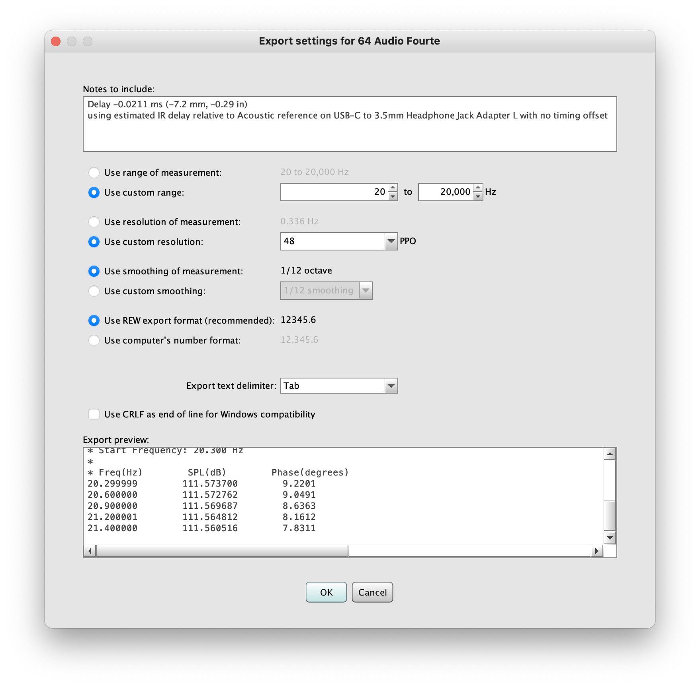

# Managing a database

## How to update a Squiglink database

This tutorial will guide you through the process of importing new measurements to Squiglink. But first, a high-level overview of the steps, from measurement to seeing the graph on Squiglink.

### 1. REW or AudioTools

- Measure your IEM
- Export your measurement as a `.txt` file

### 2. Text editor (e.g. Sublime)

- Edit the `phone_book.json` file

### 3. FTP

- Upload the new measurements
- Upload the updated `phone_book.json`

This tutorial won't walk you through the initial measurement process, but will cover the rest. Let's dive into detail.

## Exporting your measurements

I personally use [Room EQ Wizard](https://www.roomeqwizard.com/) (REW) for measurements, so these instructions are unfortunately limited to REW users. AudioTools is also capable of exporting measurements in the required format, but I'm not familiar with the process.

### Open your mdat measurement file in REW

The graph tool can't read mdat files, but instead requires txt exports. Thankfully, REW can do that.

To start, open your mdat measurement file in REW.


## Export measurement as text

While mdat files can contain multiple measurements, txt exports are singular -- so if your mdat file has measurements for both L and R channels, you'll need to export them individually as separate files.

Click `File` > `Export` > `Export measurement as text`

This will display a dialog that looks like this:



Some -- maybe all -- of the settings in this screenshot are vital to match in order for the graph tool to read the measurements, so try to match these settings exactly.

| Option                | Setting         |
| --------------------- | --------------- |
| Use custom range      | `20 - 20,000Hz` |
| Use custom resolution | `48 PPO`        |
| Use REW export format | `Checked`       |
| Export text delimiter | `Tab`           |

Click OK and save the file.

Note that your filenames will be used to identify this measurement, later in the `phone_book` file and also in your URLs. I suggest keeping the filenames pretty consistent.

- Filenames can't have underscores in them.
- Filenames must end with one of the following, depending on the measurement type:

| Measurement type | Example filename      |
| ---------------- | --------------------- |
| L channel        | `Dunu Zen L.txt`      |
| R channel        | `Dunu Zen R.txt`      |
| Target           | `Dunu Zen Target.txt` |

If your squig site is configured to use multiple samples for each measurement (e.g. to display the average of three seatings), the file naming looks like this:

| Measurement type | Example filename  |
| ---------------- | ----------------- |
| L channel        | `Dunu Zen L1.txt` |
| L channel        | `Dunu Zen L2.txt` |
| L channel        | `Dunu Zen L3.txt` |
| R channel        | `Dunu Zen R1.txt` |
| R channel        | `Dunu Zen R2.txt` |
| R channel        | `Dunu Zen R3.txt` |


## Editing the phone_book

The `phone_book.json` file acts as a directory of all of your measurement files. So when we add new measurements, we have to update the file to let the graph tool know about them.

You can edit the `phone_book` file with any basic text editor -- Notepad on Windows or TextEdit on Mac are both fine. I prefer to use [Sublime Text](https://www.sublimetext.com/), which will help with some visual formatting, but it's not necessary.

Add a new line to the `phone_book` for each earphone / headphone you've measured.

If you measure both L and R channels, you will have exported 2x txt files. You do not need to add 2x lines to the `phone_book`, just one will work.

Note that the formatting of this file is VERY particular. If you're not used to editing JSON, you will probably break this -- but that's fine. I recommend keeping a backup that you know works when making changes to the file.

The core formatting is broken up into brands and models. This is what a brand with two models looks like:

```
{
    "name":   "Akoustyx",
    "phones": [
        {"name":"R-120","file":"Akoustyx R-120"},
        {"name":"R-220","file":"Akoustyx R-220"}
    ]
}
```

A common mistake is either omitting a necessary comma (`,`) at the end of a line, or including an unnecessary comma. The screenshot below shows what a functioning phone_book looks like -- reference this if you break something and need to debug.


Save your edits and cross your fingers.

## Uploading your measurements

With your measurement files exported and the phone_book updated, it's time to take the final step and upload the files to the server via FTP.

### Complete account setup

When your Squiglink account is first created, you'll be given a username and a _temporary_ password. Before you can use this password to log in and upload changes to your site, you'll need to complete account setup by changing your password.

1. [Visit this link](https://sftpgo.squig.link/) to open the Squiglink FTP web portal.
2. Log in with your username and temporary password.
3. The web portal should ask you to change your password, which you can do by hovering over the user icon in the top-right.

Once you've changed your password, you can use your new password in an FTP program like Filezilla with these settings:


### Connect to your FTP

There are lots of possible FTP programs to use. I personally use [FileZilla](https://filezilla-project.org/), but any should work. Either way, once you're connected, the process is the same.

### Open the data folder

- Upload your files to the `/data` folder
- You will need to overwrite the existing `phone_book.json` file

If all's gone well, you should be done. Refresh your Squiglink site to see if the changes came through and are working.

## Caching

Sometimes you will make changes to your site, refresh the site, and the changes aren't reflected. This is usually because of caching.

The Squiglink website is cached by Cloudflare, which means that in the browser you may get served cached files that are "stale." To force the server to serve you fresh files, add the `?cachebust` parameter to the end of your site's URL and refresh the page twice (e.g. `https://squig.link/?cachebust` )
